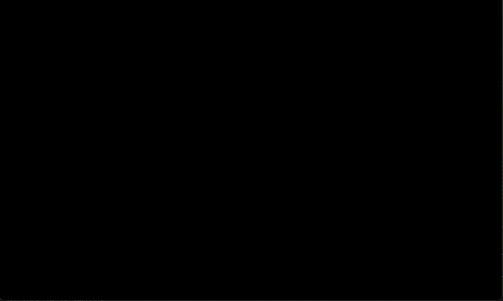
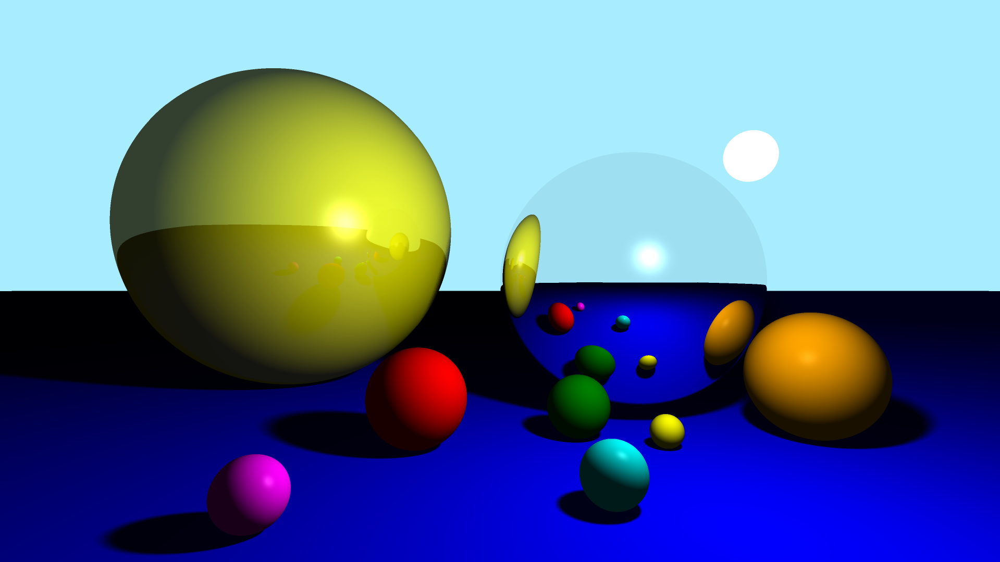

# Ray Tracing

A ray tracer software that renders a 3D scenes with realistic lighting, reflections and shadows.

## Features
- Accurate reflections and shadows
- Configurable and movable camera
- Camera rotation controls (left/right)
- Support for loading and rendering `.obj` 3D model files.
- CMake build automation
- Doxy-style documentation

## Camera Controls
- **W / S** → Move forward / backward
- **A / D** → Move left / right
- **R / F** → Move up / down
- **Q / E** → Rotate camera left / right

## Demo
### Rendering:


### Final result:


## Requirements
- A modern C compiler (e.g., GCC)

## Installation
Clone the repository
```bash
git clone https://github.com/SalerSimo/Ray-Tracing.git
cd Ray-Tracing
```

## Usage

### Using CMake
1. Build
    ```bash
    cmake -B build -S .
    ```

2. Run
    ```bash
    cmake --build build
    .\build\src\RayTracing.exe
    ```
<br>

Or just run `CMake_Build.cmd` and `CMake_Run.cmd`

<br>

### Building from Command Line

```bash
mkdir run
copy "external\lib\SDL3.dll" "run\SDL3.dll"
gcc src/*.c -Iinclude -lSDL3 -o run/RayTracing.exe
.\run\RayTracing.exe
```

Or just run `Run.cmd`

<br>

It is also possible to specify the anti-aliasing factor and the custom objects to insert in the scene by passing them as line arguments:

```bash
.\RayTracing.exe 2 firstObject.obj secondObject.obj
```
